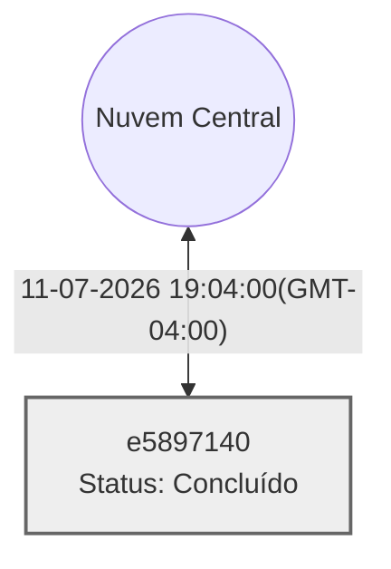

# 🧠 Painel de Contexto — Agente Local

Este repositório armazena a memória e o contexto sincronizado das sessões de trabalho guiadas por IA através do framework Vitalia.

## 📡 Topologia de Shards

## 🖥️ Máquinas e Status Atual

<table>
  <thead>
    <tr>
      <th>Máquina (ID)</th>
      <th>Tarefa Atual</th>
      <th>Status</th>
      <th>Último Sync</th>
    </tr>
  </thead>
  <tbody>
    <tr>
      <td><strong>e5897140</strong> <code>e5897140</code></td>
      <td>Implementação do Vitalia Control Plane (Dashboard)</td>
      <td>Concluído</td>
      <td>11-07-2026 19:04:00(GMT-04:00)</td>
    </tr>
  </tbody>
</table>

## 📚 Histórico de Sessões

<strong>Clique para expandir o histórico completo</strong>

## ✅ Sessão Encerrada em 09-07-2026 18:31:00(GMT-04:00)
**Máquina:** andrenote (e5897140)
**Tarefa:** Implementação do Code Extractor (Agente 3)
**Atividades:**
- Implementação e fix do CLI (`__main__.py`) do Agente 3.
- Reset de ambiente e execução de teste E2E do pipeline.
- Injeção de script de mock para pular a Fase 2 interativa.
- Aplicação do protocolo /debug para corrigir erro de CLI.
- Brainstorming arquitetural para adicionar Menu Interativo.
- Refatoração completa da Spec e do CLI para o Modo Híbrido.
**Próxima sessão começa em:** Aguardar direcionamento do Arquiteto (ex: consolidar testes, avançar documentação do framework ou refinar Agente 1).

## ✅ Sessão Encerrada em 09-07-2026 16:51:00(GMT-04:00)
**Máquina:** andrenote (e5897140)
**Tarefa:** portfolio-enricher (Fases A e B - Grafos Temporais)
**Atividades:**
- Enriquecimento semântico finalizado e validados (6 projetos)
- Correção iterativa das tags YAML (`tecnologia-avaliada`)
- Criação do `.convergencia.json` via `builder_json.py`
- Criação de renderização dinâmica (`builder_mermaid.py`)
- Injeção de Grafos Macro (`README.md`) e Micro (`CONVERGENCIA`)
**Próxima sessão começa em:** Agente 3: code-extractor (Resolução de Dependências)

---
*Dashboard gerado automaticamente pelas automações do Vitalia Kit (session-consolidate).*